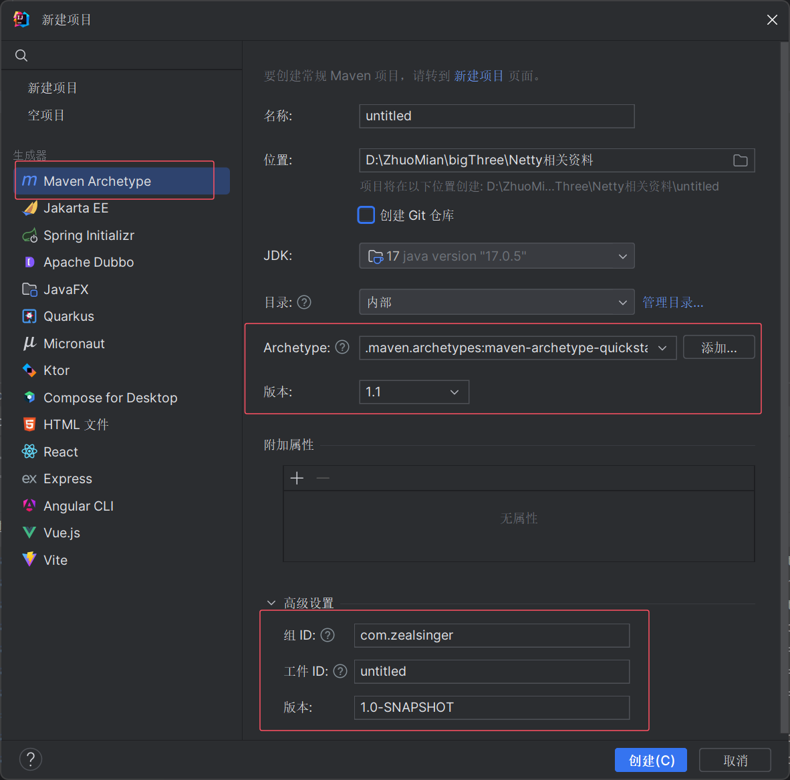
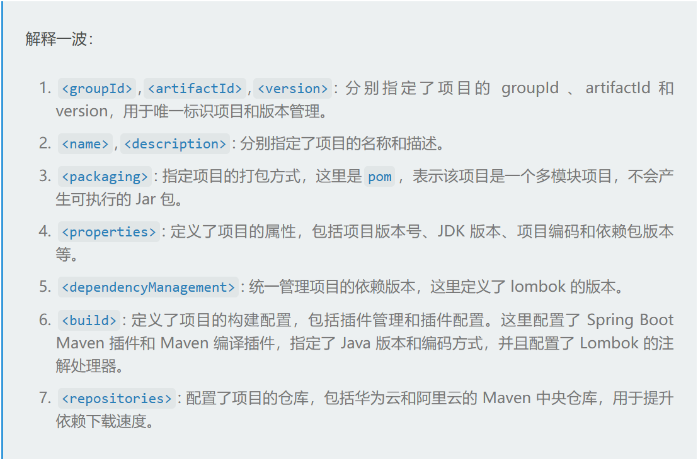
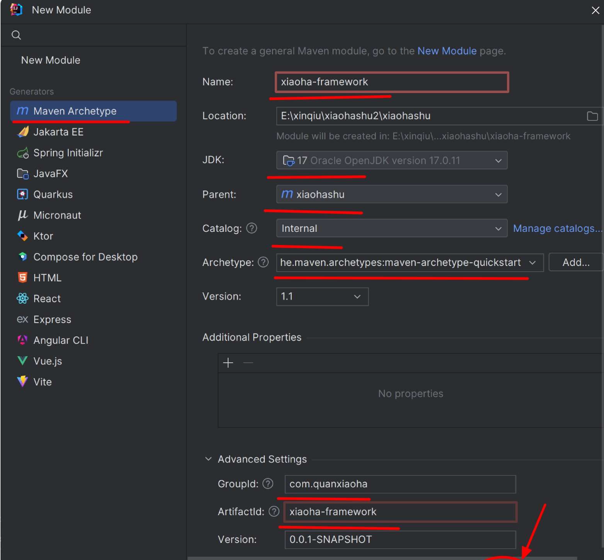
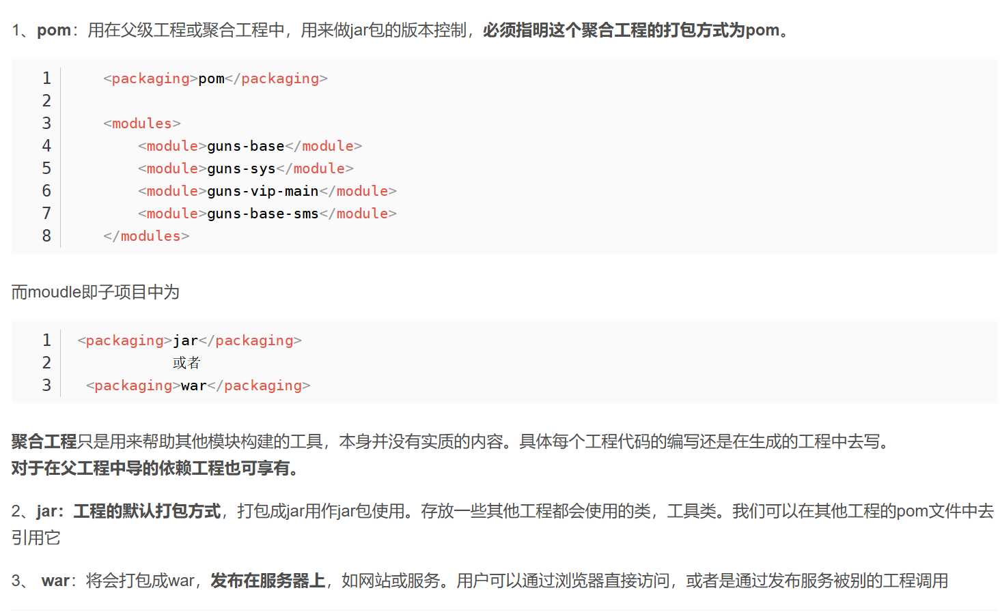

# 基础架构的搭建

为了很好的管理整个微服务架构，我们创建项目自然是一个**总的父项目+底下很多不同功能的子模块**

那么  基于我们的README中的技术选型，先开始创建基础父项目



该方法创建的父模块会自带 src目录  src目录自然一般是我们写业务代码的地方 父模块只会充当整体管理的作用  所以我们可以直接删除这个目录

然后父模块中的pom.xml文件 也就是maven的依赖管理配置文件  进行如下配置 也就是在父模块中整体导入SpringBoot 和 Spring Cloud Alibaba的版本管理

```xml
<?xml version="1.0" encoding="UTF-8"?>
<project xmlns="http://maven.apache.org/POM/4.0.0"
         xmlns:xsi="http://www.w3.org/2001/XMLSchema-instance"
         xsi:schemaLocation="http://maven.apache.org/POM/4.0.0 http://maven.apache.org/xsd/maven-4.0.0.xsd">
    <modelVersion>4.0.0</modelVersion>

    <groupId>com.zealsinger</groupId>
    <artifactId>ZealSingerBook</artifactId>
    <version>1.0-SNAPSHOT</version>

    <!--项目名称-->
    <name>${project.artifactId}</name>
    <description>基于Spring Cloud Alibaba的,微服务架构的Java项目</description>
    <!--打包方式-->
    <packaging>pom</packaging>

    <!--子模块统一管理-->
    <modules>

    </modules>

    <properties>
        <!--项目版本号-->
        <revision>0.0.1-SNAPSHOT</revision>
        <!--JDK版本-->
        <java.version>17</java.version>
        <maven.compiler.source>17</maven.compiler.source>
        <maven.compiler.target>17</maven.compiler.target>
        <!--项目编码-->
        <project.build.sourceEncoding>UTF-8</project.build.sourceEncoding>
        <!--maven相关版本号-->
        <maven-compiler-plugin.version>3.8.1</maven-compiler-plugin.version>
        <!--依赖包版本-->
        <lombok.version>1.18.30</lombok.version>
        <spring-boot.version>3.0.2</spring-boot.version>
        <spring-cloud-alibaba.version>2022.0.0.0</spring-cloud-alibaba.version>
        <spring-cloud.version>2022.0.0</spring-cloud.version>
    </properties>

    <!--统一依赖管理  防止多次依赖-->
    <dependencyManagement>
        <dependencies>

            <!--Lombok依赖-->
            <dependency>
                <groupId>org.projectlombok</groupId>
                <artifactId>lombok</artifactId>
                <version>${lombok.version}</version>
            </dependency>

            <!-- Spring Boot 官方依赖管理 -->
            <dependency>
                <groupId>org.springframework.boot</groupId>
                <artifactId>spring-boot-dependencies</artifactId>
                <version>${spring-boot.version}</version>
                <type>pom</type>
                <scope>import</scope>
            </dependency>

            <!-- Spring Cloud Alibaba 官方依赖管理 -->
            <dependency>
                <groupId>com.alibaba.cloud</groupId>
                <artifactId>spring-cloud-alibaba-dependencies</artifactId>
                <version>${spring-cloud-alibaba.version}</version>
                <type>pom</type>
                <scope>import</scope>
            </dependency>

            <!-- Spring Cloud 官方依赖管理 -->
            <dependency>
                <groupId>org.springframework.cloud</groupId>
                <artifactId>spring-cloud-dependencies</artifactId>
                <version>${spring-cloud.version}</version>
                <type>pom</type>
                <scope>import</scope>
            </dependency>
        </dependencies>
    </dependencyManagement>

    <build>
        <!--统一插件管理-->
        <pluginManagement>
            <plugins>
                <plugin>
                    <groupId>org.springframework.boot</groupId>
                    <artifactId>spring-boot-maven-plugin</artifactId>
                    <version>3.0.2</version>
                    <executions>
                        <execution>
                            <id>repackage</id>
                            <goals>
                                <goal>repackage</goal> <!-- 将依赖的 Jar 一起打包 -->
                            </goals>
                        </execution>
                    </executions>
                </plugin>

                <plugin>
                    <groupId>org.apache.maven.plugins</groupId>
                    <artifactId>maven-compiler-plugin</artifactId>
                    <version>${maven-compiler-plugin.version}</version>
                    <configuration>
                        <source>${java.version}</source>
                        <target>${java.version}</target>
                        <encoding>${project.build.sourceEncoding}</encoding>
                        <annotationProcessorPaths>
                            <path>
                                <groupId>org.projectlombok</groupId>
                                <artifactId>lombok</artifactId>
                                <version>${lombok.version}</version>
                            </path>
                        </annotationProcessorPaths>
                    </configuration>
                </plugin>
            </plugins>
        </pluginManagement>
    </build>

    <!-- 添加华为云、阿里云 maven 中央仓库，提升依赖下载速度 -->
    <repositories>
        <repository>
            <id>huaweicloud</id>
            <name>huawei</name>
            <url>https://mirrors.huaweicloud.com/repository/maven/</url>
        </repository>
        <repository>
            <id>aliyunmaven</id>
            <name>aliyun</name>
            <url>https://maven.aliyun.com/repository/public</url>
        </repository>
    </repositories>

</project>
```



# FrameWork模块的创建

微服务架构中，很多时候，**模块与模块之间任务不会相冲突，但是肯定有一些通用组件，功能是可以复用的（例如序列化工具等），为了提高代码复用性，减少重复开发，便于统一的管理和维护，提高开发效率**，在很多公司公司内部都会有个FrameWork模块，一般是数据公司内部的基础服务平台模块，写完之后打包为jar包放到公司的maven私服，每条业务线对于这部分基础模块功能就可以直接调用而不需要重复编写，出了问题也不需要每个业务线都进行修改，而是可以有FrameWork模块负责的成员修改后业务线成员刷新依赖即可全部修复（例如积加的本地maven仓库 里面包含了很多积加自己的jar包  这些jar包中就存在这种通用模块）

同样的  在IDEA中创建模块  基于上面创建的父项目进行创建即可



创建完成之后，也可以在父模块的pom.xml文件中，里面的

<modules>标签下  自动添加了刚刚创建的FrameWork模块

```xml
<?xml version="1.0" encoding="UTF-8"?>
<project xmlns="http://maven.apache.org/POM/4.0.0"
         xmlns:xsi="http://www.w3.org/2001/XMLSchema-instance"
         xsi:schemaLocation="http://maven.apache.org/POM/4.0.0 http://maven.apache.org/xsd/maven-4.0.0.xsd">
    <modelVersion>4.0.0</modelVersion>

    <!-- 指定父项目 -->
    <parent>
        <groupId>com.zealsinger</groupId>
        <artifactId>zealsingerbook</artifactId>
        <version>${revision}</version>
    </parent>

    <!-- 多模块项目需要配置打包方式为 pom -->
    <packaging>pom</packaging>

    <artifactId>zealsinger-framework</artifactId>
    <name>${project.artifactId}</name>
    <description>平台基础设施层：封装一些常用功能，供各个业务线拿来即用</description>

    <modules>
        
    </modules>

</project>
```

可以看到 这里FrameWork的打包方式和父项目的打包方式都是pom的方式  **问题来了 pom方法是jar方式有啥区别？**

简答而言就是 父模块用pom  单独子模块中jar 

**pom方式用来管理jar ； jar可以部署和被别的项目导入为依赖**



同样的，FrameWork中是一些基础的公共组件，自然不需要业务代码，所以src文件也可以直接删除即可

# 基础的统一内容的编写

创建好了FrameWork项目，我们可以开始写一些统一内容了

## 统一响应体

统一响应体肯定是必不可少的，所以这个我们可以直接创建

首先是响应格式，这个是可以自定义，按照业务需求和习惯定义即可 如下哈总给出Response  和 我个人以前项目中习惯的Response

**可以看到整体结构大差不差 无非就是 是否成功 message  data  description 状态码 来来回回这个几个字段**

（我的比哈总代码量明显少一些 这是因为我的Response纯粹的是个响应体结构，哈总里面的各种静态方法 我一般会抽离到一个ResultUtil工具类中，然后调用工具类里面方法）

```Java
/*
哈总的
*/
@Data
public class Response<T> {
    // 是否成功 默认为true
    private boolean success = true;
    // 响应消息
    private String message;
    // 异常码
    private String errorCode;
    // 响应数据
    private T data;

    public static <T> Response<T> success() {
        Response<T> response = new Response<>();
        return response;
    }

    public static <T> Response<T> success(T data) {
        Response<T> response = new Response<>();
        response.setData(data);
        return response;
    }

    public static <T> Response<T> fail() {
        Response<T> response = new Response<>();
        response.setSuccess(false);
        return response;
    }

    public static <T> Response<T> fail(String errorMessage) {
        Response<T> response = new Response<>();
        response.setSuccess(false);
        response.setMessage(errorMessage);
        return response;
    }

    public static <T> Response<T> fail(String errorCode, String errorMessage) {
        Response<T> response = new Response<>();
        response.setSuccess(false);
        response.setErrorCode(errorCode);
        response.setMessage(errorMessage);
        return response;
    }

    public static <T> Response<T> fail(BusinessException bizException) {
        Response<T> response = new Response<>();
        response.setSuccess(false);
        response.setErrorCode(bizException.getErrorCode());
        response.setMessage(bizException.getErrorMessage());
        return response;
    }

    public static <T> Response<T> fail(BaseExceptionInterface baseExceptionInterface) {
        Response<T> response = new Response<>();
        response.setSuccess(false);
        response.setErrorCode(baseExceptionInterface.getErrorCode());
        response.setMessage(baseExceptionInterface.getErrorMessage());
        return response;
    }
}


/*
我的
*/
@Data
@EqualsAndHashCode(callSuper = false)
public class BusinessException extends RuntimeException {

    private final Integer code;

    private final String message;

    private final String description;

    public BusinessException(ErrorCodeEnum errorCodeEnum, String description) {
        this.code = errorCodeEnum.getCode();
        this.message = errorCodeEnum.getMessage();
        this.description = description;
    }

    public BusinessException(HttpStatus httpStatus, String description) {
        this.code = httpStatus.value();
        this.message = httpStatus.getReasonPhrase();
        this.description = description;
    }
}

/*
ResultUtil
*/
@Component
public class ResultUtils {
    public static <T> Result<T> success(T data) {
        return new Result<>(ErrorCodeEnum.OK, data, "操作成功");
    }

    public static Result<?> error(BusinessException exception) {
        return new Result<>(exception.getCode(), exception.getMessage(), exception.getDescription(), null);
    }

    public static Result<?> error(Integer code, String message, String description) {
        return new Result<>(code, message, description, null);
    }

    public static Result<?> error(ErrorCodeEnum codeEnum, String description) {
        return error(codeEnum.getCode(), codeEnum.getMessage(), description);
    }
}
```

## 自定义异常

同时 可以看到 我和哈总的里面都会有自定义的BusinessException异常  该异常自然是继承自RuntimeException的 统一异常类型也方便后续做全局异常捕获处理器

```Java
// 哈总的
@Getter
@Setter
public class BizException extends RuntimeException {
    // 异常码
    private String errorCode;
    // 错误信息
    private String errorMessage;

    public BizException(BaseExceptionInterface baseExceptionInterface) {
        this.errorCode = baseExceptionInterface.getErrorCode();
        this.errorMessage = baseExceptionInterface.getErrorMessage();
    }
}

// 我的
@Data
@EqualsAndHashCode(callSuper = false)
public class BusinessException extends RuntimeException {

    private final Integer code;

    private final String message;

    private final String description;

    public BusinessException(ErrorCodeEnum errorCodeEnum, String description) {
        this.code = errorCodeEnum.getCode();
        this.message = errorCodeEnum.getMessage();
        this.description = description;
    }

    public BusinessException(HttpStatus httpStatus, String description) {
        this.code = httpStatus.value();
        this.message = httpStatus.getReasonPhrase();
        this.description = description;
    }
}
```

当然 哈总这里还有一个BaseExceptionInterface  统一的底层异常接口 我个人感觉对于后续异常类型的拓展会方便一些  

