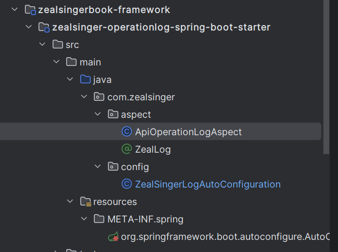
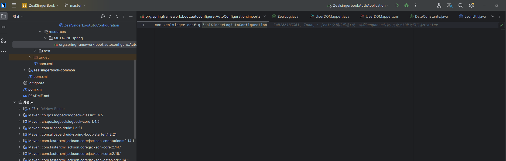

# AOP日志切面

利用AOP实现日志切面应该在平常的项目中使用的并不少，所以具体关于AOP的流程我们不进行过多的描述

我们知道 AOP实现日志切面 依靠的是自定义注解 和 @Aspect切面注解标识的切面类，在我们使用的AOP的时候，单体项目中，我们是同一个模块下，**定义好切面类和切面注解**，然后需要的类/方法上加上我们的切面注解，当这些类/方法运行的时候，就能被我们的切面类（带有@Aspect注解的类）中定义的各种环绕方法动态代理从而**实现无代码入侵的方法拓展**

但是在我们的微服务项目中，每个微服务自然是都需要用到我们的切面，但是每个模块都是分开部署的，也就是说，我们的这次的AOP属于一个公共服务模块，被导入到每一个需要的子模块中，然后每个子模块启动的时候，我们AOP日志模块中的相关内容也需要被加载到Spring的环境中，也就是说，我们的这次的AOP日志模块需要被封装为一个类似于我们用Maven导入第三方依赖的一样的spring-boot-starter的依赖包

整个模块结构最终如下  我们一个一个开始解析



# 日志服务的编写

抛开Resource和config文件，其余部分都是我们很常规AOP日志的编写

首先是自定义注解  

三个元注解声明注解的相关属性

```Java
@Retention(RetentionPolicy.RUNTIME) //生命周期 会被保存到在Runtime的时候
@Target({ElementType.METHOD})  // 注解能注解的目标类型 METHOD标识注解在方法上
@Documented  // 能被JavaDOC记录下来
public @interface ZealLog {
    /**
     * API接口功能描述
     */
    String description() default "";  // 注解的属性 属性名 description  属性值默认为 ""
}
```

有了自定义注解，就能开始编写@Aspect切面类了

定义一个类  然后带有@Aspect注解  就是一个切面类了  下面代码就是哈总给的代码  对于日志记录 大伙儿可以自定义需求 除了哈总下面的这些信息  还可以记录访问用户的身份信息；访问地址IP等信息 

```Java
@Aspect
@Slf4j
public class ApiOperationLogAspect {
    // 该注解标识了切入点规则 带有ZealLog注解的方法均会被AOP动态代理
    @Pointcut("@annotation(com.zealsinger.aspect.ZealLog)")
    public void apiOperationLog(){}


    /**
     * 环绕切面 记录入参 出参 方法名 耗时等等
     */
    @Around("apiOperationLog()")
    public Object doAround(ProceedingJoinPoint point) throws Throwable {
        String className = point.getTarget().getClass().getName(); // 类名
        String methodName = point.getSignature().getName(); // 方法名
        Object[] args = point.getArgs();  // 入参
        String argsStr = Arrays.stream(args).map(toJsonStr()).collect(Collectors.joining(","));  // 将入参转换为String类型
        String description = getDescriptionByAnnotation(point);
        long startTime = System.currentTimeMillis();
        log.info("====== 请求开始: [{}], 入参: {}, 请求类: {}, 请求方法: {} =================================== ",
                description, argsStr, className, methodName);

        // 执行切入点方法
        Object result = point.proceed();

        // 执行耗时
        long executionTime = System.currentTimeMillis() - startTime;

        // 打印出参等相关信息
        log.info("====== 请求结束: [{}], 耗时: {}ms, 出参: {} =================================== ",
                description, executionTime, JsonUtil.ObjToJsonString(result));

        return result;
    }

    /**
     * 从注解中获取description
     * @param point
     * @return
     */
    private String getDescriptionByAnnotation(ProceedingJoinPoint point){
        MethodSignature signature = (MethodSignature) point.getSignature();
        ZealLog zealLog = signature.getMethod().getAnnotation(ZealLog.class);
        if(zealLog!=null){
            return zealLog.description();
        }
        return "";
    }


    private Function<Object, String> toJsonStr(){
        return JsonUtil::ObjToJsonString;
    }

}

```

# 自动配置

上述任务完成后，我们的AOP基本的日志逻辑是完成了，但是此时，甚至都还没能实现单模块中使用切面，为啥？因为@Aspect切面类都还没有被Spring管理，不是一个Bean，如何进行代理实现AOP呢？所以我们需要将切面类表示为一个Bean，可以采用@Component注解进行标识 还可以使用@Configuration在类中使用@Bean进行注入都是可以的，我们使用后者

```Java
@Configuration
public class ZealSingerLogAutoConfiguration {
    @Bean
    public ApiOperationLogAspect apiOperationLogAspect(){
        return new ApiOperationLogAspect();
    }
}
```

好滴 此时  我们能在单体项目中成功使用AOP日志服务了，但是你一旦把这个模块依赖导入到别的模块中并尝试使用，你就会发现，AOP切面中逻辑根本没实现，这是为啥？ 

**这是因为我们配置了@Configuration只是说明在我们模块中的Spring环境下会被识别加载，当我们将整个模块作为第三方依赖导入到别的项目中的时候，@Configuration这个配置类都不在别人的Spring环境中，更别说帮我们注入@Bean标识的类了，所以我们现在就是需要将上述写的ZealSingerLogAutoConfiguration类能被其他模块的Spring环境识别从而管理我们的ApiOperationLogAspect这个Bean**

这里就不得不提到我们的SpringBoot自动注入的相关原理了，感兴趣的可以到这个博客看看


[SpringBoot自动装配底层原理和源码追踪_springboot的自动装配原理源码跟踪-CSDN博客](https://blog.csdn.net/Amax3747/article/details/134564837?spm=1001.2014.3001.5502)


**SpringBoot底层的自动注入 其实就是扫描了META-INF/spring.factories和META-INF/spring/org.springframework.boot.autoconfigure.AutoConfiguration.imports这两个文件中的内容，在这两个文件中存放了需要自动注入的Bean的类路径以及@Configuration配置类的类路径（需要注意的是 Spring Boot 早在2.7的时候 就建议入口使用META-INF/spring/org.springframework.boot.autoconfigure.AutoConfiguration.imports这个文件作为入口  但是内部底层这两个文件都是入口 所以以前也能看到这两个文件）**

所以 我们需要将我们的自动配置类的路径写道上述的两个文件中的一个即可  推荐后面那个  



这样之后 才算真正配置好了我们的AOP日志模块
